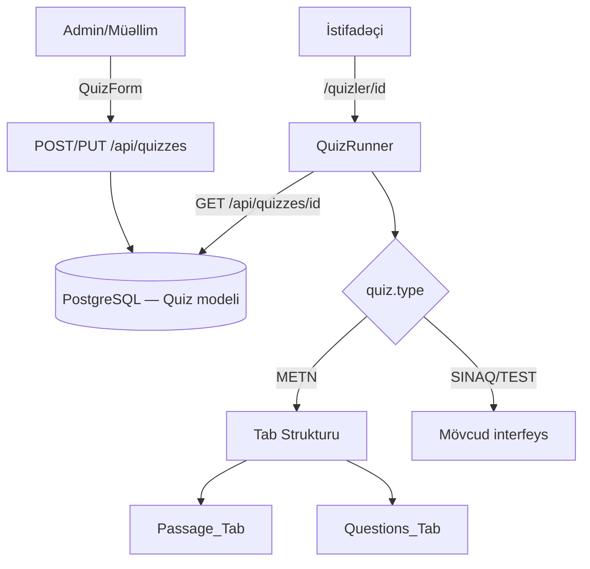

# Design Document — Text-Based Quiz (METN Tipi)

## Overview

Bu dizayn mövcud Next.js quiz platformasına yeni `METN` quiz tipini əlavə edir. `METN` tipi istifadəçiyə əvvəlcə bir passage (mətn parçası) təqdim edir; suallar həmin mətnə əsaslanır. İstifadəçi "Mətn" və "Suallar" tab-ları arasında keçid edərək quizi işləyir.

Mövcud `SINAQ` (vaxtlı) və `TEST` (vaxtsız) tipləri dəyişdirilmir. Dəyişikliklər üç əsas sahəni əhatə edir:

1. **Prisma sxemi** — `Quiz` modelinə üç yeni nullable sahə əlavə edilir.
2. **Quiz API** — yeni sahələrin oxunması, yazılması, validasiyası.
3. **UI komponentləri** — `QuizForm` (admin paneli) və `QuizRunner` (istifadəçi interfeysi) genişləndirilir.

---

## Architecture



**Əsas prinsiplər:**

- Mövcud `SINAQ`/`TEST` axını dəyişdirilmir — yeni kod yalnız `quiz.type === "METN"` şərti ilə aktivləşir.
- `QuizRunner` komponenti genişləndirilir, yeni komponent yaradılmır.
- `QuizForm` komponenti genişləndirilir — `METN` seçimi əlavə edilir, passage bölməsi şərti render olunur.
- Passage məzmunu `passageContent` sahəsində HTML formatında saxlanılır (mövcud `RichEditor` istifadə edilir).

---

## Components and Interfaces

### 1. Prisma Schema — Quiz modeli

`Quiz` modelinə üç yeni sahə əlavə edilir:

```prisma
model Quiz {
  // ... mövcud sahələr ...
  passageTitle    String?   // Passage başlığı (isteğe bağlı)
  passageContent  String?   // Passage mətni (HTML, METN tipi üçün tələb olunur)
  passageImageUrl String?   // Passage başlıq şəklinin URL-i (isteğe bağlı)
}
```

Yeni migration yaradılır: `prisma/migrations/YYYYMMDD_add_passage_fields/migration.sql`

### 2. Quiz API (`/api/quizzes`, `/api/quizzes/[id]`)

**POST `/api/quizzes`** — yeni sahələr əlavə edilir:

```typescript
// Validasiya məntiqi
if (type === "METN" && !passageContent?.trim()) {
  return 400, "Mətn əsaslı quiz üçün passage mətni tələb olunur"
}

// Prisma create
data: {
  ...existingFields,
  passageTitle:    type === "METN" ? (passageTitle || null) : null,
  passageContent:  type === "METN" ? passageContent : null,
  passageImageUrl: type === "METN" ? (passageImageUrl || null) : null,
}
```

**PUT `/api/quizzes/[id]`** — eyni validasiya və yeniləmə məntiqi.

**GET `/api/quizzes/[id]`** — `select` bloğuna yeni sahələr əlavə edilir.

**GET `/api/quizzes`** — `type=METN` filtri mövcud `where.type` məntiqi ilə avtomatik işləyir.

### 3. QuizForm komponenti (`components/admin/QuizForm.tsx`)

**Tip seçimi genişləndirilir:**

```tsx
// Mövcud: ["SINAQ", "TEST"]
// Yeni:   ["SINAQ", "TEST", "METN"]

{["SINAQ", "TEST", "METN"].map((t) => (
  <button key={t} type="button"
    onClick={() => setForm(p => ({
      ...p,
      type: t,
      duration: t === "SINAQ" ? (p.duration || 30) : p.duration
    }))}
    className={toggleBtn(form.type === t)}>
    {t === "SINAQ" ? "⏱ Sınaq" : t === "TEST" ? "📝 Test" : "📖 Mətn"}
  </button>
))}
```

**Passage bölməsi (şərti render):**

```tsx
{form.type === "METN" && (
  <div className="card-static space-y-4">
    <h2>Passage Məlumatları</h2>
    {/* Passage başlığı */}
    <input type="text" value={form.passageTitle} ... />
    {/* Passage şəkli — mövcud upload mexanizmi */}
    <PassageImageUpload ... />
    {/* Passage mətni — mövcud RichEditor */}
    <RichEditor value={form.passageContent} onChange={...} />
  </div>
)}
```

**Müddət sahəsi** — `METN` tipi üçün də deaktiv edilir (mövcud `form.type !== "SINAQ"` şərti `METN`-i avtomatik əhatə edir).

**Form state genişləndirilir:**

```typescript
const initialForm = {
  // ... mövcud sahələr ...
  passageTitle:    quiz?.passageTitle    || "",
  passageContent:  quiz?.passageContent  || "",
  passageImageUrl: quiz?.passageImageUrl || "",
};
```

**Validasiya:**

```typescript
if (form.type === "METN" && !form.passageContent?.trim()) {
  error("Mətn əsaslı quiz üçün passage mətni tələb olunur");
  return;
}
```

### 4. QuizRunner komponenti (`components/QuizRunner.tsx`)

**Yeni state:**

```typescript
const isMetn = quiz.type === "METN";
const [activeTab, setActiveTab] = useState<"passage" | "questions">("passage");
```

**`getTypeLabel` funksiyası** (`lib/utils.ts`) genişləndirilir:

```typescript
export function getTypeLabel(type: string): string {
  if (type === "SINAQ") return "Sınaq";
  if (type === "METN")  return "Mətn Əsaslı";
  return "Test";
}
```

**Start fazası** — `METN` tipi üçün `"📖 Mətn Əsaslı"` badge-i əlavə edilir.

**Running fazası** — `isMetn` olduqda tab strukturu render edilir:

```tsx
{isMetn && (
  <div className="flex gap-2 mb-6">
    <button
      onClick={() => setActiveTab("passage")}
      className={`tab-pill ${activeTab === "passage" ? "tab-pill-active" : ""}`}
    >
      📖 Mətn
    </button>
    <button
      onClick={() => setActiveTab("questions")}
      className={`tab-pill ${activeTab === "questions" ? "tab-pill-active" : ""}`}
    >
      ❓ Suallar
    </button>
  </div>
)}

{/* Passage Tab */}
{isMetn && activeTab === "passage" && (
  <PassageView quiz={quiz} onGoToQuestions={() => setActiveTab("questions")} />
)}

{/* Questions Tab (METN) or full view (SINAQ/TEST) */}
{(!isMetn || activeTab === "questions") && (
  <QuestionsView ... onGoToPassage={isMetn ? () => setActiveTab("passage") : undefined} />
)}
```

**Timer** — mövcud `isSinaq` şərti `METN`-i avtomatik istisna edir (timer yalnız `SINAQ` üçün göstərilir).

**Time bonus** — mövcud `isSinaq && !autoSubmit` şərti `METN`-i avtomatik istisna edir.

### 5. PassageView alt-komponenti (QuizRunner daxilində)

`QuizRunner.tsx` faylı daxilində inline funksiya kimi:

```tsx
function PassageView({ quiz, onGoToQuestions }: {
  quiz: any;
  onGoToQuestions: () => void;
}) {
  return (
    <div>
      {/* Başlıq şəkli */}
      {quiz.passageImageUrl && (
        <div className="relative mb-6 rounded-2xl overflow-hidden">
          
          <span className="absolute top-3 left-3 badge-lesson-material">📚 Dərs Materialı</span>
        </div>
      )}

      {/* Passage başlığı */}
      {quiz.passageTitle && (
        <h2 className="text-2xl font-bold text-slate-900 mb-4">{quiz.passageTitle}</h2>
      )}

      {/* Passage mətni — HTML render */}
      <div
        className="passage-content prose prose-slate max-w-none"
        dangerouslySetInnerHTML={{ __html: quiz.passageContent || "" }}
      />

      {/* Suallara keç düyməsi */}
      <button onClick={onGoToQuestions} className="btn-primary mt-6 w-full">
        Suallara keç →
      </button>
    </div>
  );
}
```

**`blockquote` stilləndirməsi** — `app/globals.css`-ə əlavə edilir:

```css
.passage-content blockquote {
  background-color: #1f6f43;
  color: white;
  border-left: none;
  border-radius: 12px;
  padding: 16px 20px;
  margin: 16px 0;
  font-style: normal;
}
```

---

## Data Models

### Quiz modeli (genişləndirilmiş)

| Sahə             | Tip      | Məcburi | Açıqlama                                      |
|------------------|----------|---------|-----------------------------------------------|
| `passageTitle`   | String?  | Xeyr    | Passage başlığı; yalnız METN tipi üçün        |
| `passageContent` | String?  | Şərti   | HTML mətn; METN tipi üçün məcburi             |
| `passageImageUrl`| String?  | Xeyr    | Cloudinary URL; yalnız METN tipi üçün         |

Mövcud sahələr dəyişdirilmir. `SINAQ` və `TEST` tipli quizlər üçün bu üç sahə `null` olaraq saxlanılır.

### API Payload (POST/PUT)

```typescript
interface QuizPayload {
  title:           string;
  category:        string;
  type:            "SINAQ" | "TEST" | "METN";
  duration?:       number;          // yalnız SINAQ üçün
  visibility:      "PUBLIC" | "STUDENT_ONLY";
  active?:         boolean;
  questions:       Question[];
  // Yeni sahələr (yalnız METN tipi üçün istifadə edilir)
  passageTitle?:   string;
  passageContent?: string;
  passageImageUrl?:string;
}
```

### QuizRunner Props (dəyişmir)

`QuizRunner` komponenti `quiz: any` prop-u qəbul edir. Yeni sahələr (`passageTitle`, `passageContent`, `passageImageUrl`) `quiz` obyektinin bir hissəsi kimi gəlir — prop interfeysi dəyişdirilmir.

---

## Correctness Properties

*A property is a characteristic or behavior that should hold true across all valid executions of a system — essentially, a formal statement about what the system should do. Properties serve as the bridge between human-readable specifications and machine-verifiable correctness guarantees.*

Prework analizindən aşağıdakı xüsusiyyətlər müəyyən edilmişdir:

### Property 1: Passage məlumatlarının round-trip saxlanması

*For any* etibarlı `passageTitle`, `passageContent` və `passageImageUrl` dəyərləri ilə `METN` tipli quiz yaradıldıqda, həmin quiz GET sorğusu ilə oxunduqda eyni passage məlumatları qaytarılmalıdır.

**Validates: Requirements 2.1, 2.2, 2.3**

### Property 2: Boş passage mətni rədd edilir

*For any* "boş" `passageContent` dəyəri (boş sətir, yalnız boşluqlar, null, undefined) ilə `METN` tipli quiz yaratmağa cəhd edilərsə, API `400` status kodu qaytarmalıdır.

**Validates: Requirements 2.4, 3.5**

### Property 3: SINAQ/TEST quizlərinin passage sahələri null olur

*For any* `SINAQ` və ya `TEST` tipli quiz üçün POST/PUT sorğusu göndərildikdə, `passageTitle`, `passageContent` və `passageImageUrl` sahələri `null` olaraq saxlanılmalıdır.

**Validates: Requirements 2.5, 1.4**

### Property 4: Tip filtri yalnız uyğun quizləri qaytarır

*For any* quiz kolleksiyası üçün `type=METN` filtri ilə sorğu göndərildikdə, qaytarılan bütün quizlər `METN` tipinə malik olmalıdır; digər tiplər nəticəyə daxil edilməməlidir.

**Validates: Requirements 8.3**

### Property 5: METN tipli quizlər üçün time bonus sıfırdır

*For any* `METN` tipli quiz nəticəsi üçün, `timeBonus` dəyəri sıfır olmalıdır — istifadəçinin nə qədər tez bitirməsindən asılı olmayaraq.

**Validates: Requirements 9.2**

### Property 6: getTypeLabel funksiyası bütün etibarlı tiplər üçün düzgün etiket qaytarır

*For any* etibarlı quiz tipi dəyəri (`"SINAQ"`, `"TEST"`, `"METN"`), `getTypeLabel` funksiyası boş olmayan, həmin tipə uyğun etiket qaytarmalıdır.

**Validates: Requirements 8.2**

---

## Error Handling

### API Xətaları

| Ssenari | Status | Mesaj |
|---------|--------|-------|
| `METN` tipi, boş `passageContent` | 400 | `"Mətn əsaslı quiz üçün passage mətni tələb olunur"` |
| Mövcud 400 xətaları (başlıq, kateqoriya, suallar) | 400 | Dəyişmir |
| İcazə xətaları | 403 | Dəyişmir |
| Server xətaları | 500 | Dəyişmir |

### UI Xətaları

- `QuizForm`: passage mətni boş olduqda `error()` toast göstərilir, form göndərilmir.
- `QuizRunner`: `passageContent` null olduqda boş `div` render edilir (crash yoxdur).
- Şəkil yükləmə xətaları: mövcud `error()` toast mexanizmi istifadə edilir.

### Geriyə Uyğunluq

- Mövcud `SINAQ`/`TEST` quizlərinin `passageTitle`, `passageContent`, `passageImageUrl` sahələri `null` olacaq — bu, mövcud kod üçün heç bir dəyişiklik tələb etmir.
- `getTypeLabel("TEST")` hələ də `"Test"` qaytarır; `getTypeLabel("SINAQ")` hələ də `"Sınaq"` qaytarır.

---

## Testing Strategy

### Dual Testing Approach

Bu feature həm unit/nümunə testlər, həm də property-based testlər tələb edir.

**Property-Based Testing Kitabxanası:** `fast-check` (TypeScript/JavaScript üçün standart seçim)

### Unit / Nümunə Testlər

Aşağıdakı davranışlar nümunə testlərlə yoxlanılır:

**`lib/utils.ts`:**
- `getTypeLabel("METN")` → `"Mətn Əsaslı"` qaytarır
- `getTypeLabel("SINAQ")` → `"Sınaq"` qaytarır (geriyə uyğunluq)
- `getTypeLabel("TEST")` → `"Test"` qaytarır (geriyə uyğunluq)

**`QuizForm` komponenti (React Testing Library):**
- `METN` seçimi göstərilir
- `METN` seçildikdə passage bölməsi görünür
- `METN` seçilmədikdə passage bölməsi gizlənir
- `METN` seçildikdə müddət sahəsi deaktiv olur
- Boş passage mətni ilə form göndərilmir

**`QuizRunner` komponenti (React Testing Library):**
- `METN` tipli quiz running fazasında iki tab göstərilir
- `SINAQ`/`TEST` tipli quiz running fazasında tab göstərilmir
- "Mətn" tab-ına klikləndikdə Passage_Tab görünür
- "Suallar" tab-ına klikləndikdə Questions_Tab görünür
- `METN` tipli quiz üçün timer göstərilmir
- `passageImageUrl` null olduqda şəkil bölməsi göstərilmir
- `passageTitle` mövcud olduqda başlıq göstərilir

**API Route testlər (Jest + mock Prisma):**
- `SINAQ`/`TEST` tipli quizlər üçün passage sahələri null saxlanılır

### Property-Based Testlər

Minimum 100 iterasiya hər property testi üçün.

**Property 1: Passage məlumatlarının round-trip saxlanması**
```typescript
// Feature: text-based-quiz, Property 1: passage round-trip
fc.assert(fc.asyncProperty(
  fc.record({
    passageTitle:    fc.option(fc.string({ minLength: 1 })),
    passageContent:  fc.string({ minLength: 1 }),
    passageImageUrl: fc.option(fc.webUrl()),
  }),
  async (passageData) => {
    const created = await createMetnQuiz(passageData);
    const fetched = await getQuiz(created.id);
    expect(fetched.passageContent).toBe(passageData.passageContent);
    expect(fetched.passageTitle).toBe(passageData.passageTitle ?? null);
  }
), { numRuns: 100 });
```

**Property 2: Boş passage mətni rədd edilir**
```typescript
// Feature: text-based-quiz, Property 2: empty passageContent rejected
fc.assert(fc.asyncProperty(
  fc.oneof(
    fc.constant(""),
    fc.constant(null),
    fc.string().map(s => s.replace(/\S/g, " ")), // yalnız boşluqlar
  ),
  async (emptyContent) => {
    const response = await postQuiz({ type: "METN", passageContent: emptyContent });
    expect(response.status).toBe(400);
  }
), { numRuns: 100 });
```

**Property 3: SINAQ/TEST quizlərinin passage sahələri null olur**
```typescript
// Feature: text-based-quiz, Property 3: non-METN passage fields are null
fc.assert(fc.asyncProperty(
  fc.constantFrom("SINAQ", "TEST"),
  fc.record({ passageTitle: fc.string(), passageContent: fc.string() }),
  async (type, passageData) => {
    const quiz = await createQuiz({ type, ...passageData });
    expect(quiz.passageTitle).toBeNull();
    expect(quiz.passageContent).toBeNull();
    expect(quiz.passageImageUrl).toBeNull();
  }
), { numRuns: 100 });
```

**Property 4: Tip filtri yalnız uyğun quizləri qaytarır**
```typescript
// Feature: text-based-quiz, Property 4: type filter returns only matching quizzes
fc.assert(fc.asyncProperty(
  fc.array(fc.constantFrom("SINAQ", "TEST", "METN"), { minLength: 1, maxLength: 20 }),
  async (types) => {
    // Mock DB-də müxtəlif tipli quizlər yarat
    const results = await getQuizzesByType("METN");
    expect(results.every(q => q.type === "METN")).toBe(true);
  }
), { numRuns: 100 });
```

**Property 5: METN tipli quizlər üçün time bonus sıfırdır**
```typescript
// Feature: text-based-quiz, Property 5: METN quiz time bonus is zero
fc.assert(fc.property(
  fc.record({
    startTime: fc.integer({ min: 0 }),
    elapsed:   fc.integer({ min: 0, max: 3600 }),
  }),
  ({ startTime, elapsed }) => {
    const bonus = calculateTimeBonus("METN", startTime, elapsed);
    expect(bonus).toBe(0);
  }
), { numRuns: 100 });
```

**Property 6: getTypeLabel bütün etibarlı tiplər üçün düzgün etiket qaytarır**
```typescript
// Feature: text-based-quiz, Property 6: getTypeLabel returns non-empty label
fc.assert(fc.property(
  fc.constantFrom("SINAQ", "TEST", "METN"),
  (type) => {
    const label = getTypeLabel(type);
    expect(label.length).toBeGreaterThan(0);
    expect(label).not.toBe(type); // etiket tip dəyərindən fərqli olmalıdır
  }
), { numRuns: 100 });
```

### Integration Testlər

- `POST /api/quizzes` → `GET /api/quizzes/[id]` round-trip (real DB ilə)
- `PUT /api/quizzes/[id]` passage sahələrini yeniləyir
- `GET /api/quizzes?type=METN` yalnız METN quizlərini qaytarır
